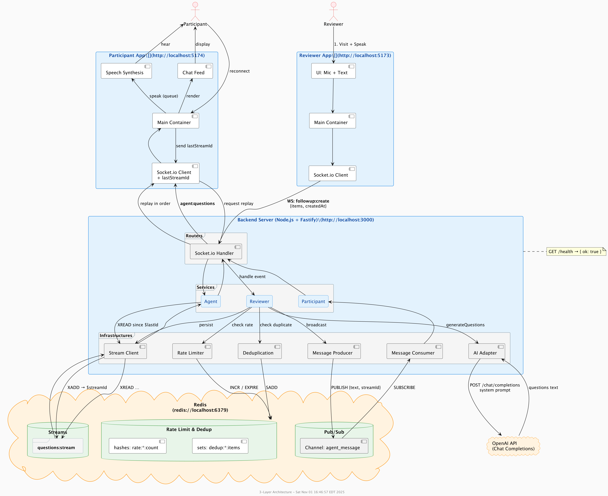

## System Overview

## Openai Usage
Openai model, system prompt and token limit are defined in .env.example.
## a screen capture showing the acceptance test
https://github.com/formcms/convo/blob/main/convo-screen-record.mov
## How to run
- Set .env
1. copy .env.example to services/server/.env 
2. add your openai api key, or leave it empty to use a stub ai adapter 
- Start redis 
```shell
docker compose up -d 
```
- Start both frontend and backend
```shell
pnpm install
pnpm --filter shared build
pnpm dev
```

go to http://localhost:5173 for reviewer app. 
go to http://localhost:5174 for participant app.  